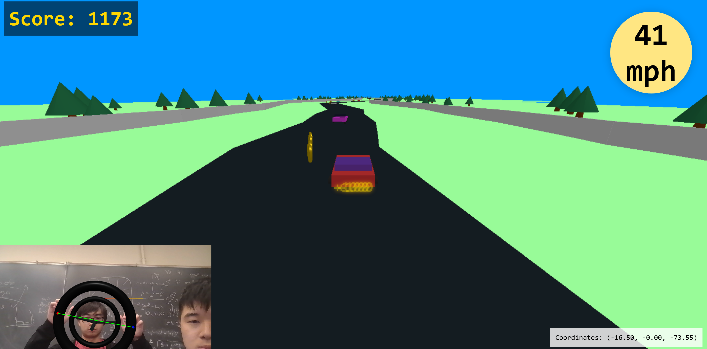

Road Rage: Driving game using computer vision.

A smashy driving game, no keyboard required! Featured at Big Red Hacks 2025 by [Alan Munschy](https://alanmunschy.com), Ben Reyes, and [William Liaw](https://williamliaw.com). Made with [mediapipe](https://github.com/google-ai-edge/mediapipe), [three.js](https://threejs.org/), and [rapier](https://rapier.rs/).

Website to play: [Road Rager](https://roadrager.io)

